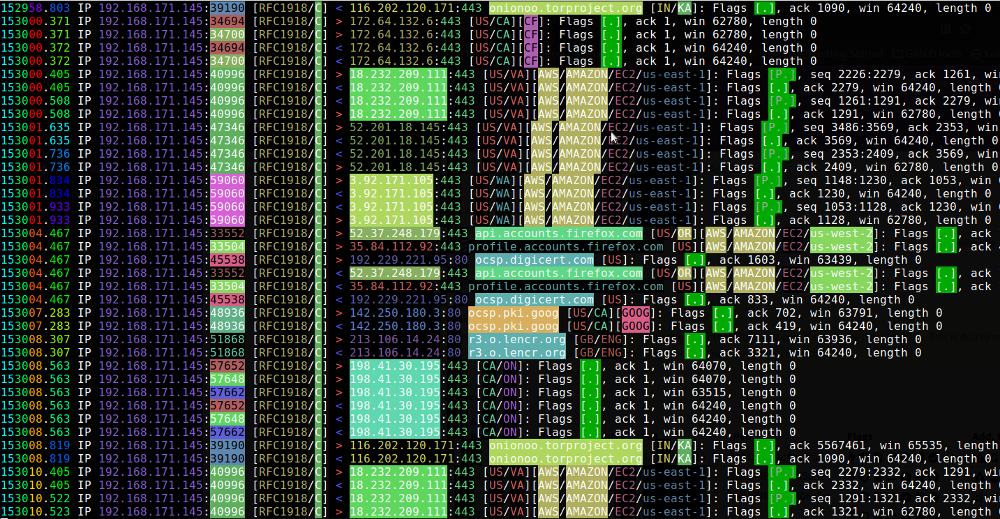
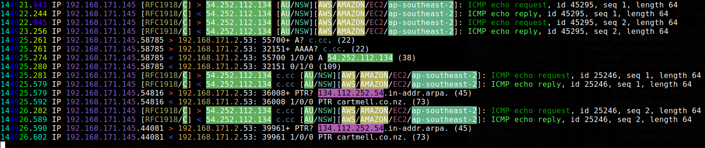
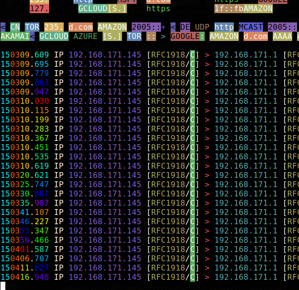

# colorful-tcpdump

Welcome to Colorful tcpdump!

# What does it do?

This script aims to make tcpdump output even more useful for debugging any and all network related issues, by adding colors and meta data for IPs and connections observed.

Please see the feature list below.

# Features

- detect local IPs used, either autonomously or by parsing it from provided 'ip addr' output.
- based on local IPs, change output so the local IPs are always displayed on the left and the arrows correspondingly switch around as well
- color code IPs, port numbers, and other interesting meta info found within or added to the output.
- provide meta information along with each IP in the output. This includes country code and other info gained from public sources, such as TOR status, ASN info, cloud provider meta info, etc. Again this is colour coded.
- When a DNS query is performed the results are cached. If an IP is subsequently seen that matches some of the resolved IPs replace it with the name that was searched for. This is a bit more intelligent than doing dumb reverse IP lookups that would often yield unhelpful results. Note this doesn't work with `tcpdump -q ...` as this doesn't print the full DNS query and results.
- cuts off long lines when they don't fit in the terminal by default (and supports terminal resizing), but has an option to wrap them instead also.
- time stamps colorized in a rolling rainbow just because we can :)

# Screenshots

Since a word only conveys a milli-picture, here are some screenshots:

ctd-dns-c.cc-cropped.png    ctd-rainbow-timestamps-cropped.png  

An example session showing some connections related to a Tor server in India, connections being made by a Firefox browser that is starting up and performing checks and logins, and some other connections. Note [GOOG] and [CF] denoting published IP ranges by Google and Cloudflare respectively.

Note that when the IP is first pinged, there is no info on its DNS name. Once the DNS lookup is performed by ping, CTD tracks and displays it with the IP.

Colorful rainbow rotating timestamps may help in visual identification of time passed between packets.

# Why?

One of my favorite tools of all time, tcpdump, has been long overdue to receiving some TLC in the form of nice colors in 2023 and beyond.

# INSTALL

(recommended: set up a virtualenv 'ctd' for the following)
pip3 install colorama netifaces maxminddb_geolite2

# TODO:

Features
	- Lookup system connections to see if a local - remote connection can be matched to a process, and add a short process name[PID] to the end of the line ( e.g. `firefox[1234]`), https://psutil.readthedocs.io/en/latest/#psutil.net_connections
	- get rid of the './ctd' wrapper, and use the script itself with a suitable system call instead like a grown up
	- Tag everything based on ASN?
	- Use a more optimized IP lookup module, namely ___

Data
	- More cloud providers (could be got from ASN?)
	- VPN providers (unfortunately more and more are reluctant to share this data without subscribing to their service)
	- Internetwide scanners
